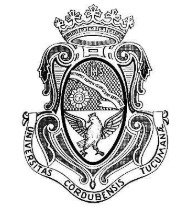
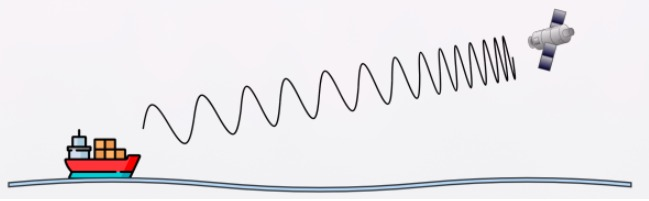
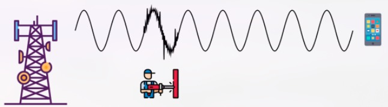

  
UNIVERSIDAD NACIONAL DE CÓRDOBA  
FACULTAD DE CIENCIAS EXACTAS, FÍSICAS Y NATURALES  
CÁTEDRA DE REDES DE COMPUTADORAS

TRABAJO PRÁCTICO Nº 1

**“Conceptos de capa física y capa de enlace de datos.”**

Grupo: “Los simuLANdores”

Alumnos:

Barrio, Rafael

Chesta, Santiago

Garay, Alexis Tomás

Guzmán Gonzalez, Pedro

Vera, Agustín

Martin, Agostina Rocio

Zucchella Paz, Valentino

Profesor:  
Ing. Santiago Martin Henn

Resolución de consignas:

Objetivos: 

* Terminar de repasar conceptos fundamentales inherentes a la capa Física (1)  
* Interiorizar didácticamente conceptos de la capa de Enlace de Datos (2)

Requisitos: 

* Acceso a computadora con Internet.  
* Bibliografía de la materia.

Consignas:  
**1\) a) ¿Qué fenómeno físico se está representando en la Figura? ¿Cuáles son las características**  
**principales del mismo?**  
****

El fenómeno es el efecto Doppler.Es el cambio aparente en la frecuencia (y en la longitud de onda) de una onda, tal como lo percibe un receptor, cuando hay movimiento relativo entre el emisor y el receptor.

Características:

\- Si emisor y receptor se acercan, la frecuencia percibida aumenta (la onda se "comprime"). La sirena de la ambulancia se pone más aguda cuando se acerca.  
\- Si se alejan, la frecuencia percibida disminuye (la onda se "estira") y suena más grave.  
\- Depende del punto de vista del receptor, por eso se dice que es aparente.  
\- A mayor velocidad relativa, mayor corrimiento, aprox f' \= f · (1 ± v/c), el signo depende de si se acercan o se alejan.

**b)** **Recordando las bandas de transmisión vistas en el TP01, investigar: ¿A qué tipos de transmisión**  
**afecta más este fenómeno? ¿Cuáles son más resilientes al mismo?**

Las transmisiones por medios guiados (cable, fibra óptica), como la onda viaja confinada no hay acercamiento o alejamiento relativo, entonces no se ven afectados.

Afecta a transmisiones por medios no guiados (inalámbricos), la onda viaja libre por el espacio. Entonces, cuando hay movimiento rápido, el receptor "ve" una frecuencia distinta a la emitida. Es un factor clave en sistemas como GPS, telefonía celular en movimiento y satélites (se mueven muy rápido respecto de la Tierra).

Comunicaciones a baja velocidad relativa (equipos fijos o de movimiento lento) les afecta menos porque el corrimiento es chico.  
Tambien existen sistemas preparados para compensarlo. Por ejemplo esquemas con ancho de banda mayor, modulaciones robustas como OFDM, y técnicas de corrección de frecuencia (AFC — Automatic Frequency Control).  
Las señales de frecuencia más baja tampoco sufren tanto, porque si bien el corrimiento relativo es el mismo (v/c), el corrimiento absoluto en Hz es menor.

**c) Investigar: ¿Cuáles son las razones por las cuales no se debe encender el celular arriba de un avión?**  
**¿Tiene algo que ver el fenómeno descrito en los puntos anteriores?**

No es estrictamente por el efecto Doppler, aunque contribuye. Es una combinación de motivos:

1\. Efecto Doppler elevado. La velocidad del avión es 800–900 km/h, implica mayor corrimiento de frecuencia, superando la tolerancia de redes celulares terrestres (se pensaron para gente caminando o en auto). El receptor no logra demodular bien la señal.  
2\. Interferencia con muchas celdas a la vez. a mayor altura, el celular "ve" muchas antenas base, no una sola. Eso satura la red y confunde el \_handoff\_ (el traspaso entre celdas), que espera ir pasando de celda en celda de forma ordenada.  
3\. Seguridad. La posible interferencia con los instrumentos de navegación del avión, que es lo que justifica la prohibición más allá de lo puramente técnico.

**2\)** Analizar la siguiente Figura y responder:  

a) ¿Qué fenómeno físico se está representando en la Figura? ¿Cuáles son las características  
principales del mismo?  
b) Recordando las bandas de transmisión vistas en el TP01, investigar: ¿A qué tipos de transmisión  
afecta más este fenómeno? ¿Cuáles son más resilientes al mismo?  
c) ¿Qué es la SNR? ¿Tiene algo que ver con el concepto de BER que vimos en el TP01?

**a) Fenómeno físico representado**

Lo que se representa es **ruido/interferencia electromagnética (EMI)** sobre la señal transmitida. Un taladro (como cualquier motor eléctrico con partes mecánicas en movimiento, escobillas, chispas eléctricas) genera **ruido electromagnético de banda ancha** que se superpone a la señal original al pasar cerca de la antena receptora, degradando la forma de onda limpia (sinusoidal) en una señal distorsionada.

**Características principales del ruido:**

* Se **suma** a la señal original (no la reemplaza), degradando su forma.  
* Puede ser de distintos tipos: **ruido térmico** (siempre presente, por agitación de electrones), **ruido de intermodulación**, **diafonía (crosstalk)**, y **ruido impulsivo** — este último es el que mejor describe el caso del taladro: picos abruptos y de corta duración, de amplitud alta, causados por descargas eléctricas o conmutaciones (como las escobillas de un motor).  
* Es **aleatorio/impredecible**, a diferencia de la atenuación o la distorsión que son fenómenos más determinísticos.  
* Afecta la relación señal/ruido (SNR) y por lo tanto la capacidad del canal (relacionado directamente con 3.8 y 3.9 del punto anterior).  
* Cuanto más cerca esté la fuente de ruido (el taladro) del receptor, o cuanto más débil sea la señal original (más atenuada), mayor es el impacto relativo del ruido.

**b) Tipos de transmisión más afectados**

* Los **medios no guiados (inalámbricos)** son los más afectados, ya que la señal viaja libremente por el aire y no tiene ningún blindaje o confinamiento físico que la proteja de fuentes de ruido externas cercanas.  
* Dentro de los guiados, el **par trenzado (UTP)** sin blindaje también es bastante susceptible a EMI, especialmente a ruido impulsivo de motores y equipos eléctricos cercanos (por eso existen variantes **STP/FTP blindadas**).  
* Recordando las bandas del TP01: las transmisiones en **frecuencias bajas** y de **banda angosta** suelen ser más vulnerables a ruido impulsivo concentrado en ciertas frecuencias, mientras que sistemas de **banda ancha** pueden promediar/tolerar mejor el impacto puntual del ruido en parte del espectro.

**Más resilientes:**

* La **fibra óptica** es la más resiliente, porque transmite mediante luz y no señales eléctricas, por lo que es **inmune a EMI**.  
* El **cable coaxial** y los pares **blindados (STP)** son más resistentes que el UTP sin blindaje, gracias al blindaje metálico que actúa como jaula de Faraday.  
* Sistemas que usan **técnicas de corrección de errores (FEC)**, **espectro ensanchado (spread spectrum)** o **modulaciones robustas** también toleran mejor la presencia de ruido impulsivo.

**c) SNR y su relación con BER**

**SNR (Signal-to-Noise Ratio / Relación Señal-Ruido):** es la relación entre la potencia de la señal útil y la potencia del ruido presente en el canal, generalmente expresada en decibelios (dB):

SNR (dB) \= 10 log₁₀ (Pseñal / Pruido)

Cuanto **mayor** es el SNR, más "limpia" es la señal respecto al ruido de fondo, y más fácil es para el receptor interpretarla correctamente.

**Relación con BER (Bit Error Rate):**

Sí, están directamente relacionados. El **BER** es la tasa de bits recibidos con error sobre el total de bits transmitidos. Cuanto **menor** es el SNR (más ruido relativo), **mayor** es la probabilidad de que el receptor interprete mal un bit, y por lo tanto **mayor es el BER**.

* SNR alto → señal más distinguible del ruido → menor BER  
* SNR bajo → señal más "contaminada" → mayor BER

Este vínculo es central en el teorema de **Shannon**, que usa justamente el SNR para determinar la **capacidad máxima teórica** de un canal ruidoso (conectando con 3.8 y 3.9 del punto anterior).

3\) Resumir brevemente y para ir pensando: ¿Cómo ayudan los sistemas de transmisión digital a detectar y corregir errores producidos por ruido en el canal? ¿Y a compensar cambios en la frecuencia?

El ruido en el canal puede alterar el valor de uno o más bits durante la transmisión. Los sistemas de transmisión digital combaten el ruido del canal mediante la **codificación de canal** , los protocolos digitales agregan **redundancia** a la información original —bits adicionales calculados a partir de los datos— que el receptor utiliza para verificar la integridad del mensaje. Los mecanismos más comunes son:

* **Detección**: bit de paridad, checksum o CRC (*Cyclic Redundancy Check*). El receptor recalcula el valor de control y lo compara con el recibido; si no coinciden, se identifica que hubo un error.  
* **Corrección sin retransmisión (FEC – *Forward Error Correction*)**: códigos como Hamming o Reed-Solomon incluyen redundancia suficiente para que el receptor pueda corregir el error por sí mismo, sin necesidad de solicitar un reenvío.  
* **Corrección con retransmisión (ARQ – *Automatic Repeat reQuest*)**: cuando se detecta un error pero no puede corregirse localmente, el receptor descarta la trama y solicita al emisor que la reenvíe.

4\) Vamos ahora a discutir e investigar cómo podemos empezar a interpretar la información una vez  
decodificada:  
a) ¿Qué significa sincronización en una comunicación digital? Investigar la diferencia entre  
sincronización de bits y sincronización de trama.  
b) ¿Qué es una trama (frame)? ¿Qué diferencias existen entre el encabezado (header), la carga útil  
(payload) y el tráiler (trailer)?  
c) ¿Qué función puede cumplir un preámbulo antes de una trama? ¿Es necesariamente parte de la  
información que se quiere transmitir?  
d) Investigar al menos tres formas mediante las cuales un protocolo puede determinar dónde termina  
una trama: longitud fija, un campo que indique la longitud y caracteres/secuencias delimitadoras.  
**4\) a)** En una comunicación digital, la sincronización es el proceso de coordinar señales, datos o eventos en el tiempo para que emisores y receptores entiendan los mensajes con precisión. Es el mecanismo por el cual el receptor se alinea temporalmente con el transmisor para saber en qué momento debe leerse cada bit y cómo deben agruparse esos bits para formar unidades de información para interpretar correctamente la información sin errores, retrasos ni confusiones.

**La sincronización de bits** permite al receptor determinar el momento exacto para leer cada bit correctamente, mientras que la **sincronización de trama** permite identificar dónde comienza y termina cada conjunto de bits para reconstruir la unidad de datos. Ambos bordan problemas distintos dentro de la comunicación digital

**Sincronización de bits:**  
Es el mecanismo por el cual el receptor determina el instante exacto en que debe muestrear la señal para reconocer correctamente cada bit transmitido, manteniendo su reloj alineado con el del transmisor. 

**Sincronización de trama:**  
Es el mecanismo por el cual el receptor determina dónde empieza y dónde termina cada unidad de datos completa (trama o carácter), una vez que ya puede leer los bits individuales correctamente. 

b) Una **trama** Es la **unidad de datos** que se transmite a nivel de enlace de Datos: un bloque estructurado de bits que agrupa los datos a transmitir junto con la información de control necesaria para que el receptor pueda interpretarlos correctamente 

**Header (encabezado)**: sección al inicio de la trama con metadatos de control — por ejemplo, direcciones de origen/destino, tipo de protocolo, número de secuencia o longitud del payload. 

**Payload (carga útil)**: los datos reales que se quieren transmitir, es decir, la información de interés para las capas superiores.

**Trailer (tráiler)**: sección al final de la trama, típicamente usada para detección de errores (ej. CRC) y, en algunos protocolos, para marcar el fin de la trama.

c) El **preámbulo** es una secuencia de bits conocida y predefinida que se envía **antes** del encabezado de la trama. Sus funciones principales son:

* **Sincronización de bits**: es una secuencia fija y predecible que le permite al receptor ajustar su reloj y "engancharse" a la señal entrante antes de que lleguen los datos reales.  
* **Detección del inicio de trama**: al final del preámbulo hay un patrón especial — el SFD (*Start Frame Delimiter*) en Ethernet — que le indica al receptor dónde termina el preámbulo y dónde arranca la trama real. 

d) Formas de determinar el fin de una trama:

1. **Longitud fija:** El protocolo define de antemano un tamaño constante para todas las tramas. El receptor simplemente cuenta una cantidad fija de bits/bytes y, al alcanzarla, sabe que la trama terminó. 

2. **Campo que indica la longitud (length field):** El encabezado (header) de la trama incluye un campo que indica explícitamente cuántos bytes tiene el payload. El receptor lee ese campo primero, y después cuenta exactamente N bytes para saber dónde termina. 

3. **Caracteres o secuencias delimitadoras:** Se utiliza un carácter o secuencia especial reservada para marcar el final de la trama (por ejemplo, un byte de "fin de trama"). El receptor lee byte a byte hasta encontrar esa secuencia. 

5\)   
Al aplicar el método de búsqueda de la firma de grupo (**los s**, correspondiente a "**Los simuLANdores**") sobre los datos digitales serializados, se encontró una única coincidencia de dicha firma en el archivo. Sin embargo, los bytes inmediatamente siguientes no corresponden a un header válido: interpretados como SEQ y LENGTH, dan valores (84 y 80 respectivamente) muy por fuera del rango observado en el resto de las tramas del archivo (SEQ entre 1 y 25, LENGTH entre 1 y 3). Además, esos mismos bytes, leídos como texto ASCII, coinciden con el inicio de la secuencia de sincronización **TPREDESDECOMPUTADORA...** que se repite como preámbulo entre las tramas reales a lo largo de todo el archivo. Se concluye, por lo tanto que **no existe en este archivo una trama real (GROUP \+ SEQ \+ LENGTH \+ PAYLOAD) asignada al grupo Los simuLANdores**.

| group | SEQ | LENGTH | PAYLOAD |
| :---: | :---: | :---: | :---: |
|  “ los s “ | 84 | 80 | `REDESDECOMPUTADORAAASSSSS` \+ 54 bytes de basura binaria |

