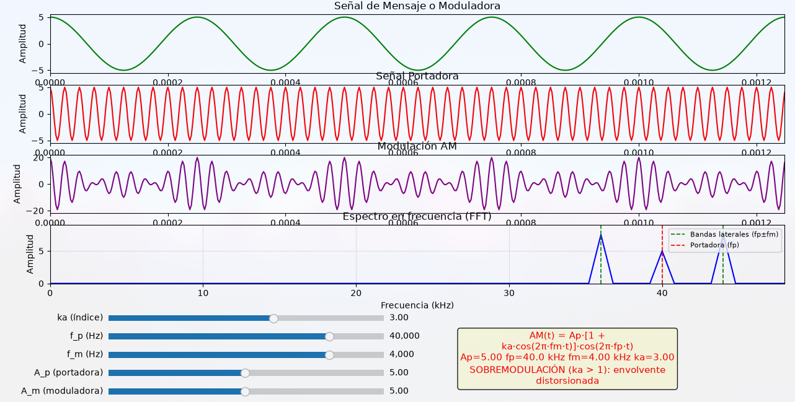

# Tarea 2 — Modulación AM en Python

Script educativo de la materia **Redes de Computadoras** para visualizar y estudiar la **modulación de amplitud (AM)**: genera y grafica la señal moduladora, la portadora y la señal AM resultante.

> Código adaptado del artículo [Modulación AM en Python](https://programacionpython80889555.wordpress.com/2024/06/04/modulacion-am-en-python/) de *El Programador Chapuzas*.

La carpeta contiene dos scripts y una captura:

| Archivo | Qué es |
|---------|--------|
| `modulacion-am-original.py` | El código original del artículo, sin modificaciones (3 gráficos, parámetros fijos). |
| `modulacion-am.py` | Versión interactiva: 4 gráficos + sliders para variar los parámetros en vivo. |
| `modulacion-am-graficos.png` | Captura de pantalla de los gráficos generados por el script. |

## ¿Qué es la modulación AM?

Es una técnica de telecomunicaciones que transmite información variando la **amplitud** de una onda de alta frecuencia (la **portadora**) según la señal que contiene el mensaje (la **moduladora**). En el dominio del tiempo la señal AM es el producto:

```
AM(t) = Ap · [1 + ka · cos(2π · fm · t)] · cos(2π · fp · t)
```

| Parámetro | Significado |
|-----------|-------------|
| `Ap` | Amplitud de la portadora |
| `fp` | Frecuencia de la portadora (alta) |
| `fm` | Frecuencia de la moduladora (baja) |
| `ka` | Índice de modulación: cuánto varía la amplitud de la portadora |
| `AM(t)` | Señal modulada resultante |

### Conceptos clave para estudiar

- **Señal moduladora**: lleva la información; suele tener menor frecuencia que la portadora.
- **Señal portadora**: onda de alta frecuencia que "transporta" la información.
- **Índice de modulación (ka)**: controla la profundidad de la modulación.
  - `ka < 1` → **submodulación** (la envolvente nunca llega a cero).
  - `ka = 1` → modulación al 100 % (la envolvente toca cero).
  - `ka > 1` → **sobremodulación**: la envolvente se distorsiona (la señal "se corta") y es más difícil de demodular.
- **Espectro en frecuencia**: además de la portadora, aparecen dos **bandas laterales** en `fp − fm` y `fp + fm`.
- **Ancho de banda**: `BW = 2 · fm` (el doble de la frecuencia de la moduladora).
- **Demodulación**: el receptor envuelve la señal AM y la filtra para recuperar la moduladora.

### Aplicaciones reales

- Radiodifusión comercial AM (530–1700 kHz).
- Comunicaciones aeronáuticas (VHF).
- Es la base para variantes más eficientes: DSB-SC, SSB y VSB (que ahorran banda o potencia).

## El script

`modulacion-am.py` es **interactivo**: genera las señales y las dibuja en una figura con 4 gráficos, y permite variar los parámetros en vivo con sliders:

1. **Señal de mensaje/moduladora** (verde): `A_m · cos(2π · f_m · t)`
2. **Señal portadora** (rojo): `A_p · cos(2π · f_p · t)`
3. **Modulación AM** (violeta): `A_p · (1 + ka · cos(2π · f_m · t)) · cos(2π · f_p · t)`
4. **Espectro en frecuencia** (FFT): muestra la portadora en `fp` y las bandas laterales en `fp ± fm` (ancho de banda total `BW = 2·fm`).

Al arrastrar un slider, las 3 señales y el espectro se recalculan al instante. El script muestra la fórmula con los valores actuales y avisa en rojo cuando `ka > 1` (**sobremodulación**) o cuando la configuración es inválida (alias, `fp ≤ fm`).



> **Nota:** el script original del artículo (`modulacion-am-original.py`) usaba `t = np.linspace(0, 1, 1000)` con `f_p = 40 kHz`, lo que produce alias (la portadora no se ve como senoide). La versión interactiva corrige esto muestreando al menos 10 puntos por período de la portadora.

### Parámetros configurables (valores iniciales)

| Variable | Valor | Rango del slider | Nota |
|----------|-------|------------------|------|
| `A_m` | 5 | 0.1 – 10 | Amplitud de la moduladora |
| `f_m` | 4000 | 100 Hz – 10 kHz (log) | Frecuencia de la moduladora |
| `A_p` | 5 | 0.1 – 10 | Amplitud de la portadora |
| `f_p` | 40000 | 1 – 100 kHz (log) | Frecuencia de la portadora |
| `ka` | 3 | 0 – 5 | Índice de modulación |

**Ojo:** `ka = 3` es sobremodulación (mayor a 1). La envolvente queda distorsionada. Probá llevarlo a `ka = 1` o `ka = 0.5` y compará la forma de la señal AM y la altura de las bandas laterales en el espectro.

## Requisitos e instalación

Python 3 con `numpy` y `matplotlib`. Ya hay un entorno virtual con todo instalado:

```bash
python -m venv .venv
source .venv/bin/activate
pip install numpy matplotlib
```

## Cómo ejecutarlo

```bash
python modulacion-am.py
```

Se abre una ventana con los 4 gráficos y los sliders en la parte inferior. Al inicio se imprime en consola una breve explicación de cada control.

## Referencias

- [Artículo original: Modulación AM en Python](https://programacionpython80889555.wordpress.com/2024/06/04/modulacion-am-en-python/)
- Stallings, *Comunicaciones y Redes de Computadores* (capítulos de transmisión analógica).